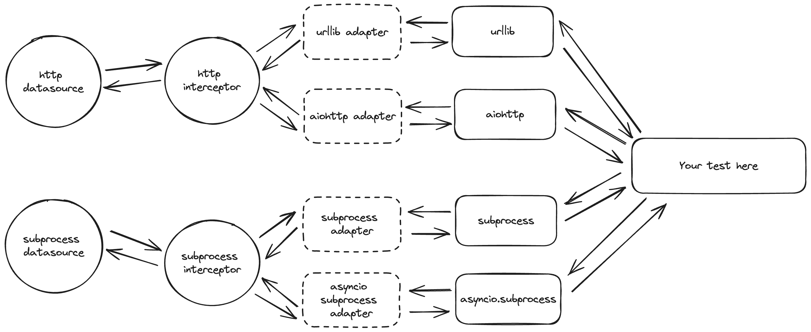

# Testing framework documentation

1. [Testing framework documentation](#testing-framework-documentation)

   1.1. [Rational](#rational)

   1.2. [High level architecture](#high-level-architecture)

      1.2.1. [Adapters](#adapters)

      1.2.2. [Interceptors](#interceptors)

      1.2.3. [Data Sources](#data-sources)

      1.2.4. [Data Source Specs](#data-source-spec)
2. [General practice on how to write the tests](#general-practice-on-how-to-write-the-tests)
   

## Rational

The main goal of the framework is to avoid mocking existing parts of code.

Instead, we'd like to mock the underlying layers of whatever libraries the code depends on.

This makes it possible to move the dependency on the actual application code from the tests, making the tests a lot more robust.

## High level architecture



The framework provides a few building blocks:
* Adapters: takes a call from a Python library and makes that call acceptable by the interceptor.
* Interceptors: Take adaptor request from the adaptor, and sends it to the data source.
* Data sources: Searching for the response based on the interceptor's request.
* Data source specs: A set of rules to match the provided request.

### Adapters

Adapters are ment to be used to provide a unified call structure to the interceptors.

Adapter is a low level piece that actually mock the desired Python library.

You can have a single interceptor with many adapters, where adapter would unify a library call, and make it compatible with the interceptor.

1. When we call any Python library, call first goes to the adapter to "adopt" the call. 
2. This adapted result goes to the interceptor to route the call to a datasource associated with the interceptor.

### Interceptors

An Interceptor is responsible for calling the datasource with an adapted request + expected response type.

1. Call the datasource routing logic to receive the response.

   1.1. provide expected response type datasource should follow.
2. If response found, send it back to Adapter.
3. If no response found, notify the Adapter as well.

   3.1. Adapter will respect that there's no response, and propagate the call to a prent mock (if any) or to the original function being mocked.

### Data sources

A data source is responsible for routing the request from interceptor and returning appropriate result.

Data source might have any custom logic you want for the routing, but thes framework provides you with a few abstractions (see examples part of the doc).

### Data source spec

In order to match the request, your data source should have a `spec` attributes on its method, i recommend setting that attribute using decorators.

A spec is any class that defines method `validate`, that returns `True/False` (matched or not) + the context dict.

The context dict is then passed to your data source, it a way of propagating additional info to the data source as a result of validation.

# Examples

## Using the framework

Here I'll show you how to create your own Data sources, Interceptors and Adapters.

### Sample use case

Let's say we need to make a request somewhere in our code, and we want to test that code.

The code:
```python
import httpx

URL = "https://google.com"  # whatever URL here

def foo():
    response = httpx.get(URL).json()
    return response["data"]
```
The test:
```python
def test_foo():
    result = foo()
    assert result == {"hello", "world"}
```
A very simple test here. Now, in order to avoid hitting the actual URL, we'll need to __intercept__ it.

Let's create the Adapter first.

In order to create the Adapter, we need to identify what method of a target library we'd like to mock.

In case of httpx library, that should be `httpx.Client.send`. All the requests going through that method.

Let's define our request spec first:
```python
from collections import namedtuple

HTTPX_REQUEST_SPEC = namedtuple("HTTPXRequestSpec", ("method", "url", "request"))
```

The Adapter:
```python
from test_utils.networking.adapters import HTTPMockAdapters
from functools import partial
from unittest.mock import patch
import httpx

class HttpxAdapter(HTTPMockAdapters, name="httpx"):
    RESPONSE_TYPE = httpx.Response
    MOCK_OBJ = partial(patch.object, httpx.Client, "send")

    @property
    def original_fn_ref(self):
        return httpx.Client.send

    def build_request(self, instance, request, *args, **kwargs):
        return HTTPX_REQUEST_SPEC(
            method=request.method, url=str(request.url), request=request
        )
```
The `RESPONSE_TYPE` you should figure out on your own, reading through the library sources, or create a new one.

The Interceptor:
```python
from test_utils.networking.interceptors import BaseInterceptor

class HttpxInterceptor(BaseInterceptor):
    ADAPTERS = ["httpx"]
```
Here we created a new Interceptor and set its Adapter to previously created `httpx`.

The DataSource:
```python
import json
from test_utils.networking.data_sources.base import BaseDataSource
from test_utils.networking.data_sources.decorators import http_intercepts

class HTTPXDataSource(BaseDataSource):
    @http_intercepts("GET", "google.com", api_version=None)
    def google_request(
        self,
        request,
        response_type,
        context,
    ):
        return response_type(
            200,
            content=json.dumps({"data": {"hello": "world"}}),
            request=request.request,
            headers={"content-type": "application/json"},
        )
```
Note: we used `http_intercepts` decorator to intercept http request.

Now we can rewrite our test as follows:
```python
def test_foo():
    interceptor = HttpxInterceptor.create_interceptor_for(HTTPXDataSource())
    with interceptor.intercept():
        result = foo()
    assert result == {"hello": "world"}  # passes
```
As you can see, we don't need to mock any of the code in `foo` function.

No additional setup needed in order to invoke the interceptors. Its already running once you enter the test.

# General practice on how to write the tests
1. Split the test cases into positive and negative
2. Avoid mocking the parts of a code that's being tested, use the testing framework
3. Test the critical logic only, don't make the tests too brittle